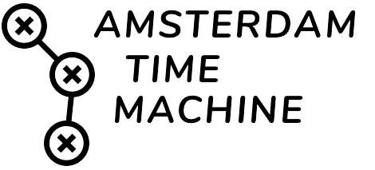
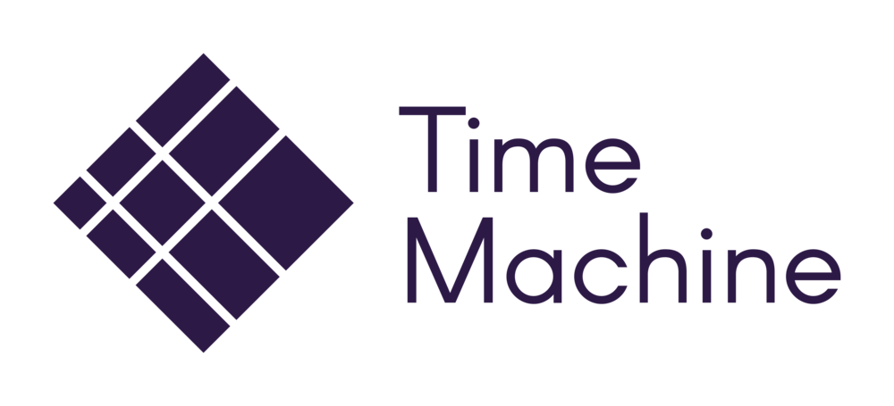

## Amsterdam Time Machine

The [Amsterdam Time Machine](https://amsterdamtimemachine.nl/) (ATM) is developing a digital time machine for the city of Amsterdam: an infrastructure that is navigable through space and time that consists of different sets of socio-cultural historical information. It connects various sets of historical data to get an image of Amsterdam’s past. Our collaborative efforts extend to societal partners such as museums, public archives, and local citizen communities. Users will eventually be able to travel back in time, allowing them to explore the city at different historical junctures, from neighborhoods and streets to individual houses. By doing so, they can gain valuable insights into how people lived in Amsterdam during past centuries.

The Amsterdam Time Machine is based on a linked and open structure and collaborates closely with other Dutch Time Machines, as a proud member of the [European Time Machine](https://www.timemachine.eu/) Organization. This ensures that the Amsterdam data is connected across the Netherlands and abroad. Just as the city itself has always been. 

The Amsterdam Time Machine is coordinated by the [CREATE Lab](https://www.create.humanities.uva.nl/), a research programme and lab of the [University of Amsterdam](https://uva.nl/), dedicated to digital humanities.

For more information, see: https://www.amsterdamtimemachine.nl/

